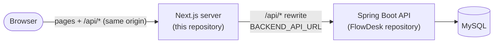

# FlowDesk frontend

Next.js 16 (App Router), React 19, TypeScript and Tailwind frontend for FlowDesk, a
production-style IT service management application (tickets, role-based workflow, SLAs,
notifications, audit log). The API, business rules and full project documentation live in
the Spring Boot backend: [FlowDesk](https://github.com/JaiswalS2812/FlowDesk-).

**Live demo:** https://frontend-production-70e2.up.railway.app

## Role of this application

- Renders the UI: login and registration, dashboard, ticket list with filters and paging,
  ticket detail (workflow actions, assignment, comments, SLA status), new ticket, account
  (password change), and the admin pages for users, SLA policies and the activity log.
- Holds the JWT after sign-in (`localStorage`) and sends it as `Authorization: Bearer` on
  every API call (`src/lib/api-client.ts`), signing the user out on **401**.
- Hides pages and actions a role cannot use (`useRequireAuth`). This is for usability only:
  every permission is enforced again by the backend.
- Acts as the only public entry point: its Node.js server proxies `/api/*` to the backend, so
  the browser never talks to the backend directly.



Project layout: `app/` (routes; `(protected)/` requires sign-in), `src/services/` (one API
module per backend area), `src/lib/api-client.ts` (fetch wrapper, token and error handling),
`src/contexts/AuthContext.tsx` (signed-in user), `src/components/` (layout, notification bell,
UI primitives), `src/types/` (API types).

## How it talks to the backend

The browser calls `/api/*` on this server only. `next.config.ts` rewrites (proxies) those
requests to `BACKEND_API_URL` (default `http://localhost:8080`). The backend address is
therefore never exposed to the browser and no CORS setup is needed.

`BACKEND_API_URL` is read when the app is **built** (`next build` writes the rewrite into the
server's routes manifest), so set it before building; changing it requires a rebuild. It is
not a `NEXT_PUBLIC_` variable and does not appear in browser JavaScript.

Notifications are fetched over the same API: the bell polls the unread count once a minute
while the tab is visible and loads the list when opened (no WebSockets).

### Client IP forwarding

The backend's login throttling counts failures per client IP and reads it from
`X-Forwarded-For` when the request comes from this server. The Next.js rewrite proxy passes
that header through unchanged and does not add the client's address, so the production server
runs with `forwarded-for.mjs` preloaded (`npm start` and the Docker image both do). It appends
the address of each incoming connection, like a standard reverse proxy, so a client cannot
choose the IP the backend sees. Run the production server through `npm start`, not plain
`next start`.

Behind a platform edge proxy that every request must pass through, set `CLIENT_IP_HEADER` to
the header that edge always overwrites with the client IP (`x-real-ip` on Railway). The
preload then uses that header as `X-Forwarded-For` instead of the connection address, which
would be the edge's. Leave it unset when clients connect directly (Docker Compose).

## Environment variables

| Variable | When | Purpose |
|---|---|---|
| `BACKEND_API_URL` | build time | Backend base URL for the `/api/*` rewrite (server-side only) |
| `CLIENT_IP_HEADER` | runtime | Edge header carrying the client IP (`x-real-ip` on Railway); unset locally |
| `PORT` | runtime | Server port (default `3000`) |

None of these is a secret. `.env*` files are git-ignored and excluded from the Docker image.

## Local development

The simplest way to run everything is the Docker Compose stack in the backend repository
(see its README, "Local development"). To run only the frontend against a backend on
`localhost:8080`:

```bash
npm install
echo BACKEND_API_URL=http://localhost:8080 > .env.local   # git-ignored
npm run dev
```

Open http://localhost:3000. Production build without Docker: `npm run build`, then
`npm start`.

## Production (Railway)

Deployed as the `frontend` service of the Railway project described in the backend README:
the only service with a public domain (HTTPS at Railway's edge, port 3000, health check
`/login`). `BACKEND_API_URL` points to the backend's private domain
(`http://backend.railway.internal:8080`), so API traffic stays on Railway's private network,
and `CLIENT_IP_HEADER=x-real-ip`. Deploy with `railway up --service frontend`.

## Docker

The image is built and run by the Docker Compose stack in the backend repository
(`docker-compose.yml` there), which passes `BACKEND_API_URL=http://backend:8080` as a build
argument. To build the image on its own:

```bash
docker build --build-arg BACKEND_API_URL=http://backend:8080 -t flowdesk-frontend .
```

The `Dockerfile` installs dependencies and runs `next build` with `NEXT_OUTPUT_STANDALONE=1`
(enables `output: "standalone"`), then copies only the standalone server and
`forwarded-for.mjs` into a `node:22-alpine` runtime image that runs as the non-root `node`
user on port 3000. Development dependencies, sources and `.env*` files are not part of the
runtime image.

## Security headers

`next.config.ts` sends a Content-Security-Policy, `X-Frame-Options: DENY`,
`X-Content-Type-Options: nosniff`, `Referrer-Policy`, `Permissions-Policy`,
`Cross-Origin-Opener-Policy` and `Strict-Transport-Security` on every page, and removes
`X-Powered-By`. TLS itself is terminated by the hosting edge (Railway in production).

## End-to-end tests

Playwright tests in `e2e/` run against a running stack (for example the Docker stack); see
[e2e/README.md](e2e/README.md). They create their own test users and must not be run against
production.
