<div align="center">

# FlowDesk

**IT service management for teams that run on tickets, SLAs and accountability.**

Raise requests, route them to the right engineer, track every deadline and see who changed
what, all in one role-aware workspace.

<br />

[](https://flowdesk-demo.up.railway.app)

<br />


**[🚀 Live Demo](https://flowdesk-demo.up.railway.app)** &nbsp;·&nbsp;
[Features](#features) &nbsp;·&nbsp;
[Architecture](#architecture) &nbsp;·&nbsp;
[Getting started](#local-development) &nbsp;·&nbsp;
[Source](https://github.com/JaiswalS2812/flowdesk)

</div>

---

## ✨ Overview

FlowDesk is a production-style IT service management application. This repository is its
**web frontend**: a Next.js 16 / React 19 app that gives each role (employee, support
engineer, manager and administrator) a focused workspace for tickets, SLAs, notifications and
administration.

Behind it, a Spring Boot REST API backed by MySQL owns the business rules, authorization,
SLA tracking, notifications and the audit log. The backend is part of the FlowDesk system,
but its source repository is private; this README documents how the two fit together. The
frontend is the single public entry point: it serves the UI and securely proxies API traffic
to the backend over a private network.

> [!TIP]
> The public demo is one URL: **https://flowdesk-demo.up.railway.app**. You don't need a
> separate backend address; register an account and you're in.

---

## 🖼️ Application Preview

Screenshots of the running application (production build, desktop viewport). The data shown
is synthetic test data from a local development database.

### Sign in

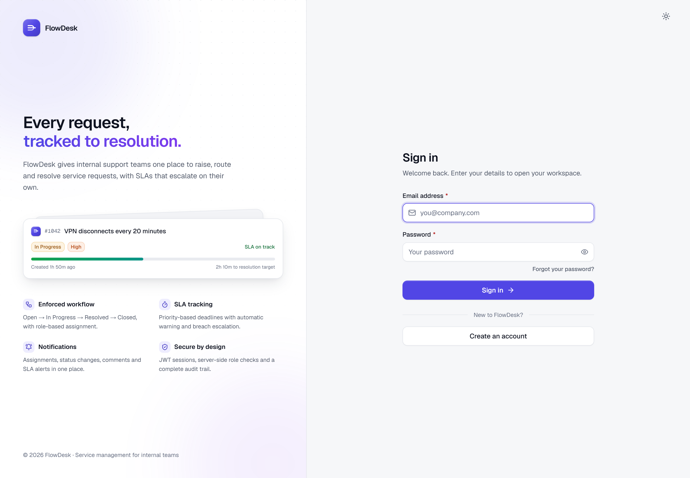

The sign-in screen, with a summary of what FlowDesk does alongside the form.

### Dashboard

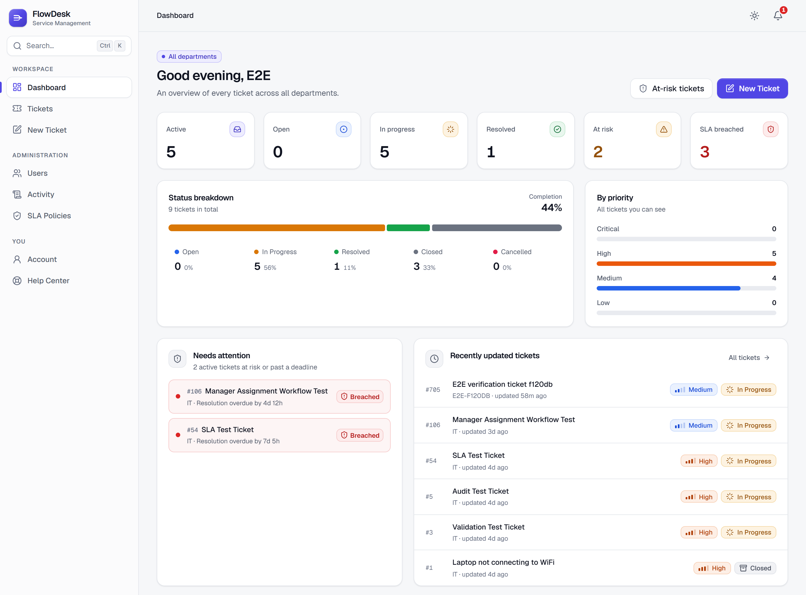

Role-scoped KPIs, status and priority breakdowns, SLA risks that need attention and the latest
ticket activity.

### Tickets

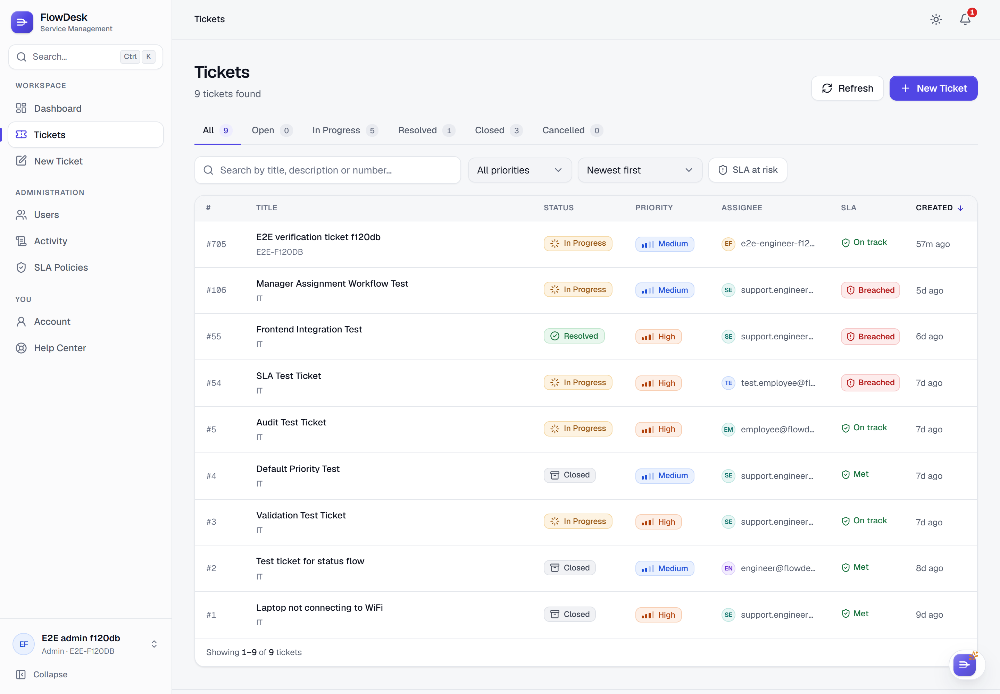

Status tabs with live counts, search and filters, and a sortable table showing each ticket's
status, priority, assignee and SLA state.

### Ticket details

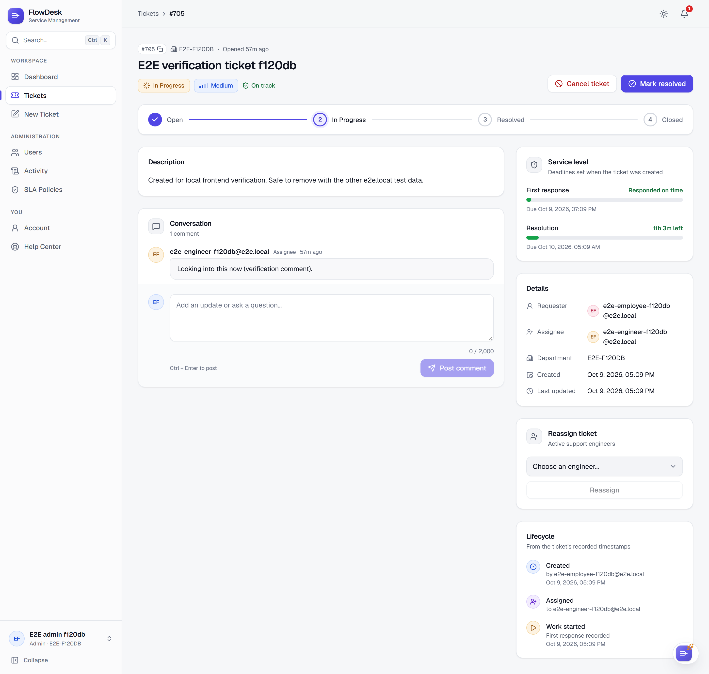

Workflow actions, a progress tracker, the conversation thread, live SLA meters, assignment and
a lifecycle timeline built from the ticket's own timestamps.

### SLA policies

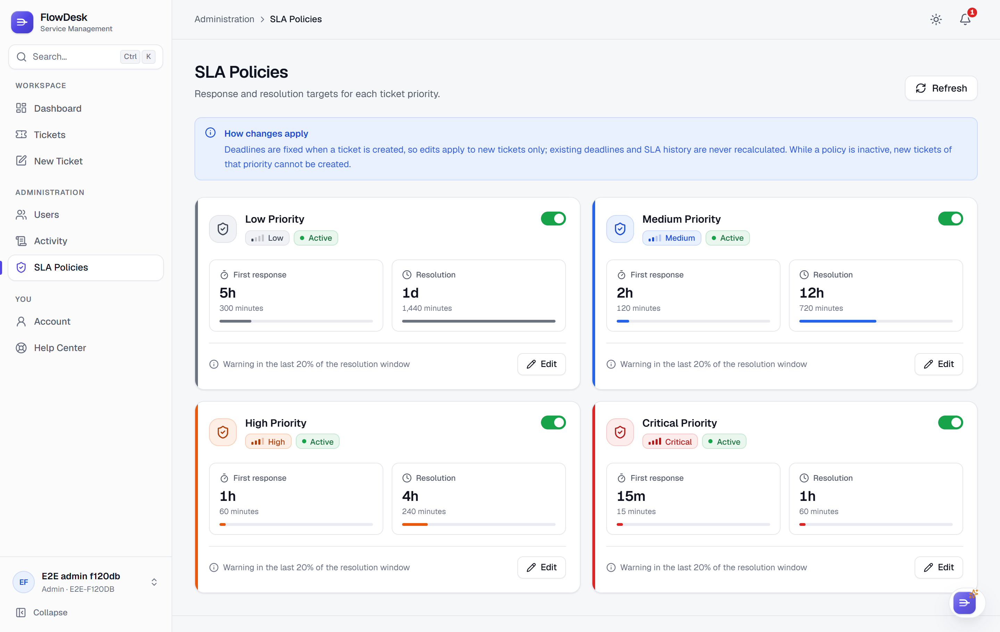

Administrators set first-response and resolution targets for each priority and can activate or
deactivate a policy.

### Dark theme

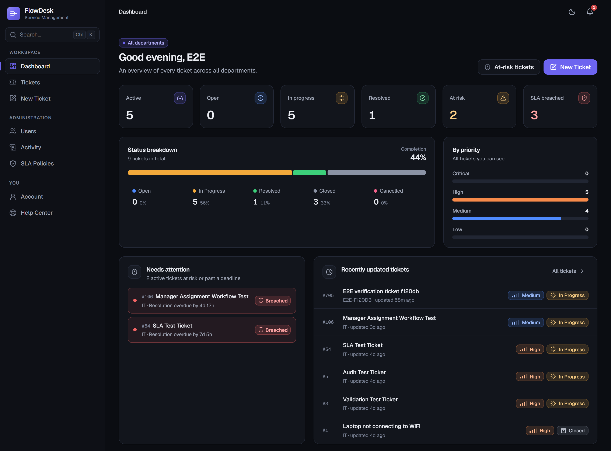

The same dashboard in the dark theme. Light, Dark, Warm and System themes are available from
the top bar.

### Warm theme & FlowDesk Assistant

The Warm theme is a low-glare option for long sessions, with paper-like surfaces and copper
accents. These screenshots also show the FlowDesk Assistant open: a rule-based helper (it
follows fixed rules and does not use AI) that answers from the tickets your role can see and
from the Help Center.

#### Account with the Assistant

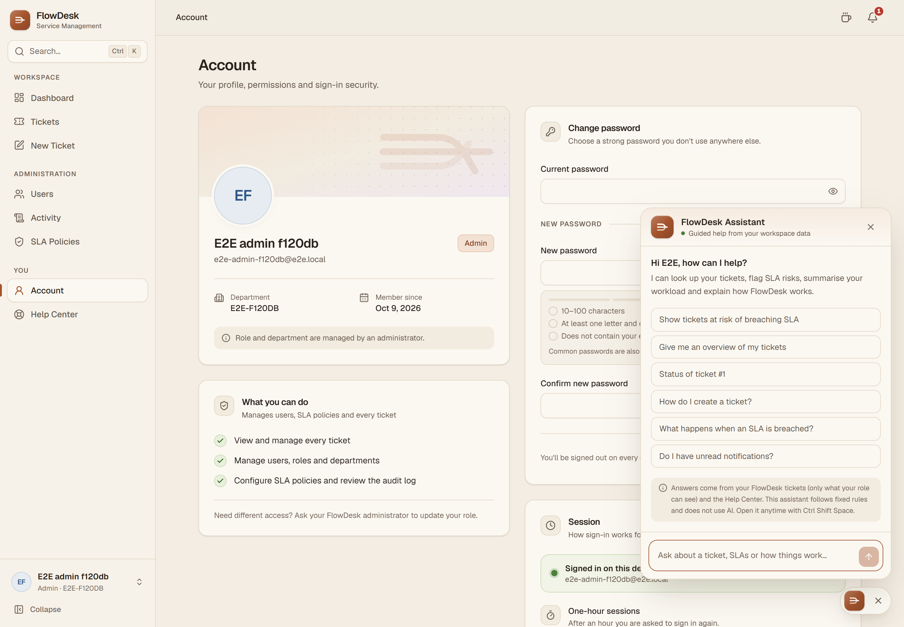

The Account page alongside the Assistant's welcome screen and suggested questions.

#### Dashboard with the Assistant

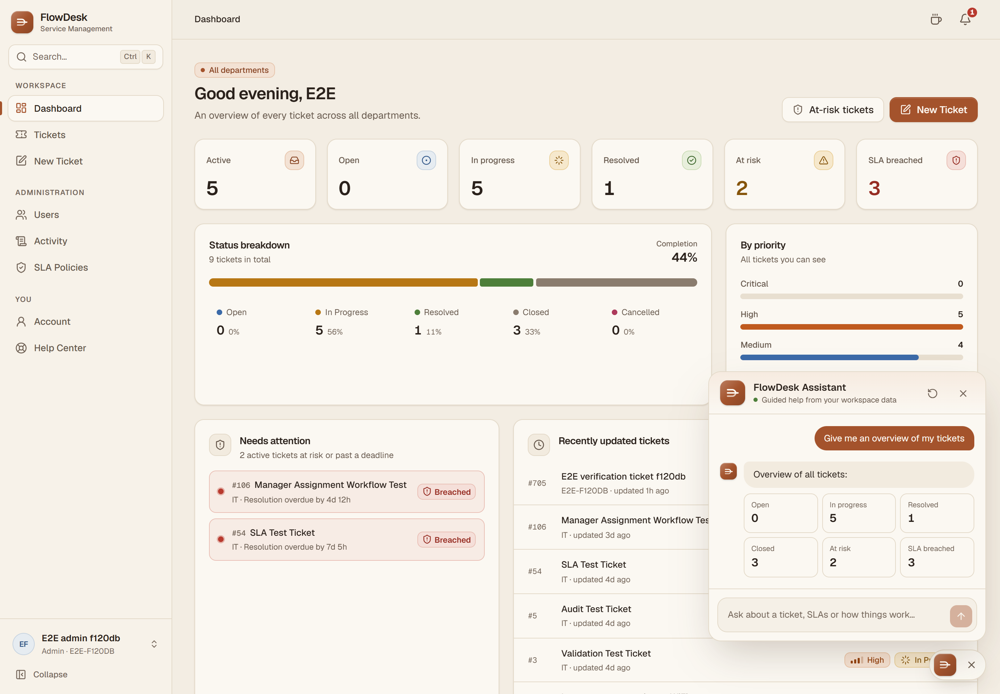

Asking for an overview returns the same ticket counts the dashboard is built on.

#### Tickets with the Assistant

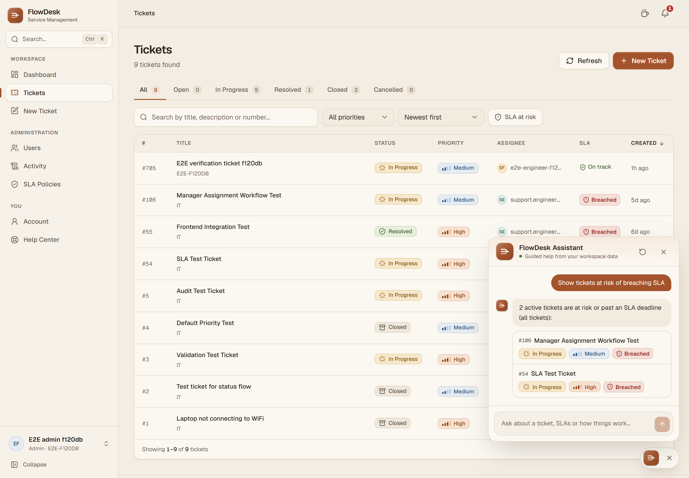

Asking about SLA risk lists the affected tickets, each linking to its detail page.

### Every screen at a glance

| Screen | What you'll find |
|---|---|
| **Dashboard** | Role-scoped KPIs, status and priority breakdowns, SLA risk, and quick actions tailored to the signed-in role |
| **Tickets** | Search, status/priority filters, an "at risk" view, sorting and paging, all kept in the URL so views are shareable |
| **Ticket detail** | Workflow actions, assignment, live SLA meters, a lifecycle timeline and the conversation thread |
| **Users** *(admin)* | Roles, departments, activation and deactivation; users are deactivated, never deleted |
| **Activity** *(admin)* | Filterable audit log of ticket, SLA, user and security events |
| **SLA Policies** *(admin)* | Response and resolution targets per priority |
| **Account** | Profile, a summary of what your role can do, password change and session details |
| **Help Center** | Searchable, deep-linkable product documentation |

> Explore every screen live at **[flowdesk-demo.up.railway.app](https://flowdesk-demo.up.railway.app)**.

---

<a id="features"></a>

## 🧩 Features

<table>
<tr>
<td width="50%" valign="top">

### 🎫 Ticket Management
- Create tickets with title, description and priority (**Low → Critical**)
- Status workflow: Open → In Progress → Resolved → Closed, or Cancelled
- Assignment to support engineers of the ticket's department
- Conversation thread on every ticket
- Lifecycle timeline: created, responded, resolved, closed

</td>
<td width="50%" valign="top">

### ⏱️ SLA Tracking
- Response and resolution deadlines per priority, fixed at creation
- Live SLA meters on each ticket
- **At risk** in the last 20% of the resolution window
- **Breached** response and resolution are flagged and escalated
- Admin-managed SLA policies

</td>
</tr>
<tr>
<td valign="top">

### 🔔 Notifications
- Assignments, status changes and new comments
- Resolved and closed tickets
- SLA warnings and breaches
- Changes to your own role or department
- Notification center with unread count and toasts for new arrivals

</td>
<td valign="top">

### 📋 Audit & Accountability
- Activity log of every significant change
- Ticket events: created, assigned, status changed, commented
- SLA events: breaches and policy changes
- User events: role, department, deactivation and reactivation
- Security events: password changes

</td>
</tr>
<tr>
<td valign="top">

### 👥 User Administration
- Change roles and departments
- Deactivate and reactivate accounts (no hard deletes)
- Safeguards: no changing your own role, and engineers' open work must be reassigned first
- Password change signs out every existing session

</td>
<td valign="top">

### 🤖 FlowDesk Assistant
A **rule-based** helper, not an AI model. It can:
- Look up a ticket by number
- List tickets at risk of breaching SLA
- Summarize your workload
- Check unread notifications
- List tickets by status
- Answer how-to questions from the Help Center

Anything else is routed to a human by creating a ticket.

</td>
</tr>
<tr>
<td colspan="2" valign="top">

### 🎨 Modern, Accessible UI
- **Light**, **Dark** and **Warm** themes, plus **System**, chosen from one compact header control and applied before first paint (no flash)
- **Command menu** (`Ctrl/⌘ K`): jump to pages, open tickets, search, switch theme
- **Assistant shortcut** (`Ctrl/⌘ + Shift + Space`) or the *"Need a hand?"* launcher
- Responsive layouts; tables switch to cards based on available width
- Accessible primitives (Radix) with focus traps and keyboard support; motion respects `prefers-reduced-motion`

</td>
</tr>
</table>

---

## 🛡️ Roles

Each role sees only the pages and actions it can use. This is for usability only: **every
permission is enforced again by the backend.**

| Role | Sees | Can do |
|---|---|---|
| 👤 **Employee** | Tickets they created | Create tickets, comment, follow updates |
| 🛠️ **Support Engineer** | Tickets assigned to them | Move assigned tickets through the workflow, comment, receive SLA warnings |
| 📊 **Manager** | Every ticket in their department | Create tickets, assign to the department's engineers, change status, receive SLA alerts |
| 🔑 **Admin** | Every ticket | Everything above, plus users, roles and departments, SLA policies and the audit log |

---

## 🔄 Ticket Lifecycle

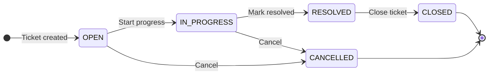

- Tickets are created by Employees, Managers or Admins.
- A **Manager** (same department) or **Admin** assigns an engineer; a ticket needs one before
  it can start or be resolved.
- The first move to *In Progress* counts as the SLA **response**.
- *Closed* and *Cancelled* are final; cancelled tickets are excluded from SLA tracking.

---

<a id="architecture"></a>

## 🏗️ Architecture

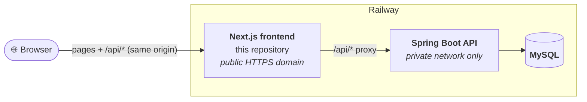

| Layer | Technology | Repository |
|---|---|---|
| **Frontend** | Next.js 16 · React 19 · TypeScript · Tailwind CSS 4 | [JaiswalS2812/flowdesk](https://github.com/JaiswalS2812/flowdesk) (this repository) |
| **Backend** | Spring Boot REST API (business rules, authorization, SLA checks, notifications, audit) | Private repository |
| **Database** | MySQL | Managed by the backend |

**Backend at a glance** *(private source)*

- **Spring Boot REST API** with JWT bearer authentication and role-based authorization on
  every endpoint
- **Ticket workflow rules**: who may create, view, assign and move tickets, enforced
  server-side
- **SLA engine**: deadlines fixed per priority at creation, plus a background check every
  minute that records escalation levels, logs the first breach and notifies the assigned
  engineer and department managers
- **Notifications and audit log** written for assignments, status changes, comments, SLA
  events and user or security changes
- **Account security**: password policy, login throttling per client IP, and sign-out of all
  sessions after a password change
- **MySQL** persistence, reachable only on Railway's private network

**How it fits together**

- 🔐 **One public origin.** The browser only ever calls `/api/*` on the frontend. Next.js
  rewrites those requests to the backend, so the backend is never exposed and no CORS setup is
  needed.
- 🎟️ **JWT authentication.** After sign-in the token is sent as `Authorization: Bearer` on
  every API call (`src/lib/api-client.ts`); a `401` signs the user out.
- 🧭 **Role-aware UI.** `useRequireAuth` and `components/layout/nav.ts` hide what a role can't
  use; the backend remains the authority.
- 📨 **Polling notifications.** The bell checks the unread count once a minute while the tab
  is visible (no WebSockets).

---

## 🧰 Tech Stack

| Area | Tools |
|---|---|
| Framework | **Next.js 16** (App Router, Turbopack), **React 19** |
| Language | **TypeScript** (strict) |
| Styling | **Tailwind CSS 4** with a token-based design system (`app/globals.css`) |
| UI primitives | **Radix UI** (Dialog, Dropdown Menu, Tooltip), **cmdk** (command menu), **lucide-react** (icons) |
| Fonts | Geist, self-hosted via `next/font` |
| API | REST over a same-origin proxy, JWT bearer auth |
| Testing | **Playwright** end-to-end tests |
| Delivery | **Docker** (Node 22 Alpine, standalone output) on **Railway** |

No charting or animation library is shipped: charts are CSS bars and motion is CSS-only.

---

## 📁 Project Structure

```text
flowdesk-frontend/
├── app/                      # Routes (App Router)
│   ├── (auth)/               #   Sign-in and registration (shared layout)
│   ├── (protected)/          #   Signed-in area: dashboard, tickets, users,
│   │                         #   activity, sla-policies, account, help
│   └── globals.css           #   Design tokens and the three themes
├── src/
│   ├── components/
│   │   ├── ui/               # Design-system primitives (Button, Table, Dialog, …)
│   │   ├── layout/           # App shell, navigation, command menu, theme switcher
│   │   ├── assistant/        # FlowDesk Assistant UI and rule-based engine
│   │   ├── notifications/    # Notification bell and panel
│   │   └── tickets/          # Status, priority and SLA badges
│   ├── services/             # One API module per backend area
│   ├── lib/api-client.ts     # fetch wrapper: token, errors, 401 handling
│   ├── contexts/             # Auth and theme providers
│   ├── hooks/                # useRequireAuth, useDebouncedValue
│   ├── content/help.ts       # Help Center articles
│   ├── types/                # API types (mirror the backend)
│   └── utils/                # Formatting and status/role → colour mapping
├── e2e/                      # Playwright tests
├── forwarded-for.mjs         # Client-IP forwarding for the API proxy
├── next.config.ts            # API rewrite and security headers
└── Dockerfile                # Multi-stage production image
```

---

<a id="local-development"></a>

## 💻 Local Development

**Prerequisites:** Node.js 22 and npm, plus a running FlowDesk backend.

> [!NOTE]
> The frontend needs the FlowDesk backend API to work, and the backend source is kept in a
> private repository. To explore the full application, use the
> **[live demo](https://flowdesk-demo.up.railway.app)**. The steps below run the frontend
> against a backend on `localhost:8080`.

```bash
# 1. Install dependencies
npm install

# 2. Point the API proxy at your backend (file is git-ignored)
echo BACKEND_API_URL=http://localhost:8080 > .env.local

# 3. Start the dev server
npm run dev
```

Open **http://localhost:3000**.

| Command | Purpose |
|---|---|
| `npm run dev` | Development server |
| `npm run build` | Production build |
| `npm start` | Production server (with client-IP forwarding) |
| `npm run lint` | ESLint |
| `npm run test:e2e` | Playwright tests (against a local stack only) |

### Environment variables

| Variable | When | Purpose |
|---|---|---|
| `BACKEND_API_URL` | build time | Backend base URL for the `/api/*` proxy (server-side only, default `http://localhost:8080`) |
| `CLIENT_IP_HEADER` | runtime | Edge header carrying the client IP (`x-real-ip` on Railway); leave unset locally |
| `PORT` | runtime | Server port (default `3000`) |

None of these is a secret, and `BACKEND_API_URL` never reaches browser JavaScript. Because
Next.js writes the rewrite at build time, changing it requires a rebuild.

---

## 🚀 Deployment

The live demo runs on **Railway** as the `frontend` service, the only service with a public
domain:

- HTTPS terminated at Railway's edge, port `3000`, health check on `/login`
- `BACKEND_API_URL=http://backend.railway.internal:8080`, so API traffic stays on Railway's
  private network
- `CLIENT_IP_HEADER=x-real-ip`

<details>
<summary><b>Docker image</b></summary>

<br />

```bash
docker build --build-arg BACKEND_API_URL=http://backend:8080 -t flowdesk-frontend .
```

The multi-stage `Dockerfile` runs `next build` with `NEXT_OUTPUT_STANDALONE=1`, then copies
only the standalone server and `forwarded-for.mjs` into a `node:22-alpine` image that runs as
the non-root `node` user on port 3000. Sources, dev dependencies and `.env*` files are not in
the runtime image.

</details>

<details>
<summary><b>Client IP forwarding</b></summary>

<br />

The backend throttles failed logins per client IP, read from `X-Forwarded-For`. The Next.js
rewrite proxy doesn't add the client address, so the production server preloads
`forwarded-for.mjs` (both `npm start` and the Docker image do). It appends each connection's
address like a standard reverse proxy, so clients can't choose the IP the backend sees.

Behind an edge proxy, set `CLIENT_IP_HEADER` to the header that edge always overwrites
(`x-real-ip` on Railway). Leave it unset when clients connect directly.

</details>

---

## 🔒 Security

- **Strict headers** on every page: Content-Security-Policy (same-origin only),
  `X-Frame-Options: DENY`, `X-Content-Type-Options: nosniff`, `Referrer-Policy`,
  `Permissions-Policy`, `Cross-Origin-Opener-Policy` and `Strict-Transport-Security`;
  `X-Powered-By` is removed.
- **No exposed backend.** All API traffic goes through the same-origin proxy.
- **Server-side authorization.** UI permissions are a convenience; the backend enforces them.
- **No secrets in the client.** Configuration is server-side, and `.env*` files are
  git-ignored and excluded from the image.

---

## 🧭 Scope & Honesty Notes

To keep the demo truthful, these are intentionally **not** presented as working:

- Password reset and email verification by email
- Real-time push (notifications are polled once a minute)
- Avatar or branding uploads (the controls are shown disabled)
- AI chat: the assistant is rule-based, and adding a language model would need a backend
  endpoint holding the provider key

---

## 🧪 End-to-End Tests

Playwright tests in [`e2e/`](e2e/README.md) run against a local, non-production stack.
They create their own users and **must not be run against production**.

---

<div align="center">

**[🚀 Try the live demo](https://flowdesk-demo.up.railway.app)** &nbsp;·&nbsp;
**[📦 Frontend source](https://github.com/JaiswalS2812/flowdesk)** &nbsp;·&nbsp;
🔒 Backend: Private repository

Built with Next.js, React and TypeScript by [JaiswalS2812](https://github.com/JaiswalS2812).

</div>
